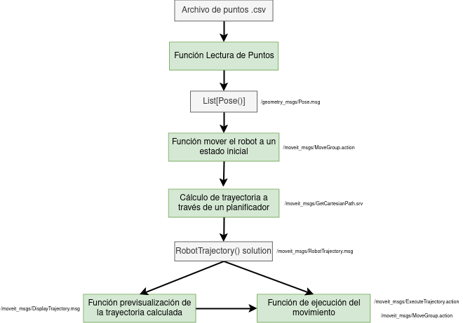

# Instalación
Create workspace and clone this repo:

```
source /opt/ros/humble/setup.bash
mkdir -p workspace/ros_ur_driver
cd workspace/ros_ur_driver
git clone -b humble_prueba git@github.com:INGENIA-ETSII-23-24/ingenia_ws.git src
vcs import src --skip-existing --input src/Universal_Robots_ROS2_Driver/Universal_Robots_ROS2_Driver-not-released.${ROS_DISTRO}.repos
rosdep update
rosdep install --ignore-src --from-paths src -y
colcon build --cmake-args -DCMAKE_BUILD_TYPE=Release
source install/setup.bash
```
Si ocurren fallos durante el colcon build, actualizar sistema operativo:
```
sudo apt update
sudo apt upgrade
```

## Launch the simulation
```
ros2 launch ur_bringup lanzar_simulacion.launch.py 
```


## Launch the real robot
```
ros2 launch ur_bringup lanzar_robot.launch.py   
```

# Timeline  

Todos los programas realizados se han guardado en la carpeta de launch del paquete de trabajo [ur_bringup](./Universal_Robots_ROS2_Driver/ur_bringup/). Estos programas no están integrados en el entorno de ROS2, son programas independientes que utilizan algunos recursos de ROS2. Se ha hecho de esta manera porque era lo más sencillo, pero en líneas futuras del proyecto, se deberá integrar todo como uno o varios nodos de ROS.  

La cronología de los programas del proyecto en el curso 2023/2024 es la siguiente:  

1) [adela.py](./Universal_Robots_ROS2_Driver/ur_bringup/launch/adela.py) Primer intento de comunicación con el robot a través de ROS. Se ejecuta cada punto de la trayectoria definido en un archivo .csv, pero bloqueando manualmente la publicación de cada punto cada 10 ms.

2) [salsa_secreta.py](./Universal_Robots_ROS2_Driver/ur_bringup/launch/salsa_secreta.py) En este segundo intento se elimina el bloqueo para cada punto de la trayectoria, implementando una función AjustarTiempo para adecuar la velocidad para cada par de puntos de la trayectoria.
   
3) [cartesian_path_node](./Universal_Robots_ROS2_Driver/ur_bringup/launch/cartesian_path_node.py) En este intento se cierra un bucle de control con un suscriptor al estado del robot. Así, el programa espera recibir una señal de control del robot para cada punto objetivo de la trayectoria hasta que haya alcanzado el punto anterior.

4) [moveJ.py](./Universal_Robots_ROS2_Driver/ur_bringup/launch/moveJ.py) Este programa es la versión final de lo que estábamos haciendo. El problema de las versiones anteriores era que había una pausa notable para cada punto. Para solucionar esto, se publica todos los puntos de la trayectoria al mismo tiempo. Funciona perfectamente, pero para muchos puntos tarda mucho tiempo en iniciar el programa, incluso en muchas ocasiones se queda pillado.

5) [moveL.py](./Universal_Robots_ROS2_Driver/ur_bringup/moveL.py) Este programa es el programa recomendado para las pruebas. En este porgrama se utiliza otro servicio para el cálculo de la trayectoria (GetCartesianPath.srv) y una acción para la ejecución de la trayectoria (ExecuteTrajectory), en vez de utilizar el topic. Este programa ha dado los mejores resultados en las pruebas, aunque presenta algunos problemas.

El esquema generalizado del funcionamiento de moveL.py es el siguiente:  



Estos primeros intentos sirvieron para entender la comunicación con un robot real de manera sencilla. El problema de utilizar Python es que el servicio que calcula la trayectoria, y los parámetros de control del movimiento del robot son independientes.  

# Líneas futuras  

Se ha conseguido entender la comunicación con el robot para la ejecución de trayectorias sencillas. La planificación del movimiento del robot era una responsabilidad compartida con @Producto. De esta manera, en la parte de programación de @Arquitectura se utilizan [algoritmos básicos de optimización de código abierto](https://moveit.picknik.ai/humble/doc/examples/ompl_interface/ompl_interface_tutorial.html). Sin embargo, en el planificador no se tiene en cuenta los parámetros de control del robot: para la planificación, solo se tienen los puntos por los que tiene que pasar, ejecutándolos a la velocidad máxima.  

Se proponen las siguientes soluciones:  
1) Implementación de nodos de C++ integrados en el espacio de trabajo de ROS2. En C++ existe una clase donde se tiene integrado tanto el planificador de trayectorias como el ejecutor del movimiento en MoveIt2. Se han planteado los primeros pasos de un [nodo integrado](Universal_Robots_ROS2_Driver/ingenia). 
  
2) Utilizar otros entornos de simulación diferentes de MoveIt.


# Enlaces de interés  

* Los tutoriales de ROS2 que nosostros nunca recibimos. Enlace [aquí](https://docs.ros.org/en/humble/Tutorials.html)
* Inspección de mensajes, servicios y acciones de ROS-MoveIt2. Enlace [aquí](https://github.com/moveit/moveit_msgs/tree/humble)
* Tutorial de MoveIt2 para realizar un nodo de ROS-MoveIt2. Enlace [aquí](https://moveit.picknik.ai/humble/doc/examples/move_group_interface/move_group_interface_tutorial.html)
* Ejemplo de implementación parecida a lo que buscamos. Enlace [aquí](https://github.com/tlpss/UR3e-ROS2-resources/blob/64f1d1a42d28bdd3f600f78857f5319178600a52/src/ur3e_tutorials/src/move_group_interface_tutorial.cpp#L224)

